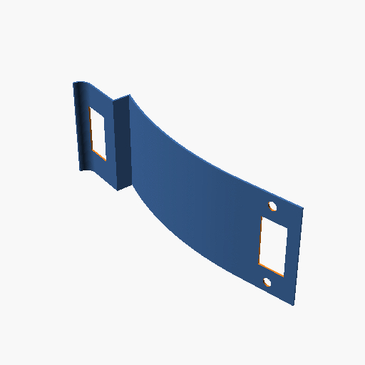
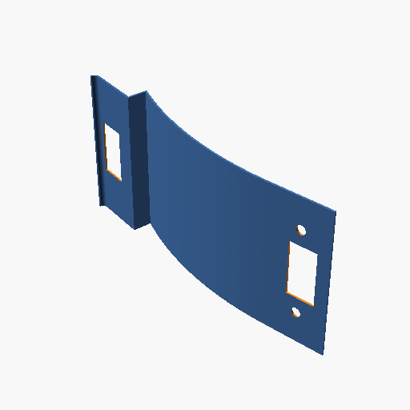
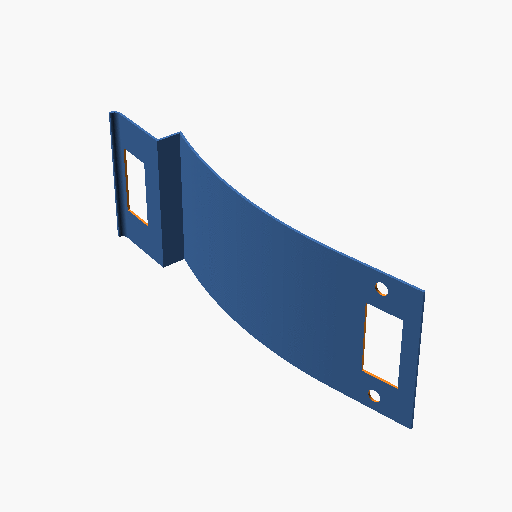
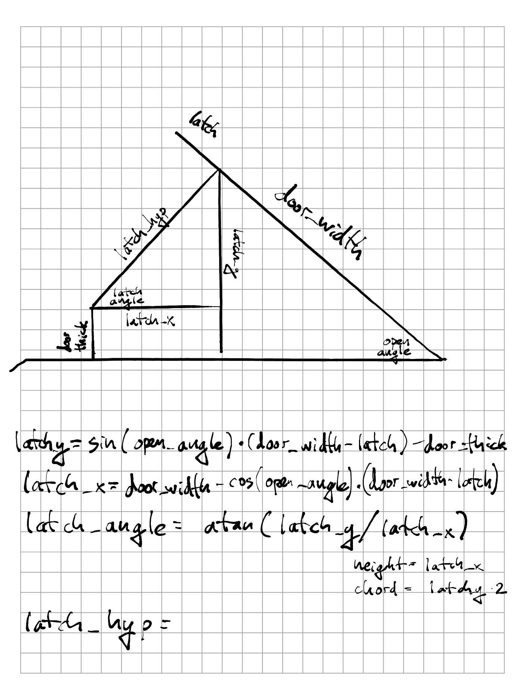

# Open Door Catch
OpenSCAD door catch that will keep the door slightly open.  Keeps the dog out while letting the cat access the litter box. 

Depending on your door this could be setup so that the door can still be closed all the way.

# Varibles
Animations of variables that can be tweaked in the source script.
## open_angle

## latch

## wall

## close_r

## height

## catch

## trim_base

## trim_end

# Math
Keeping these for future reference in case I need to change things.

